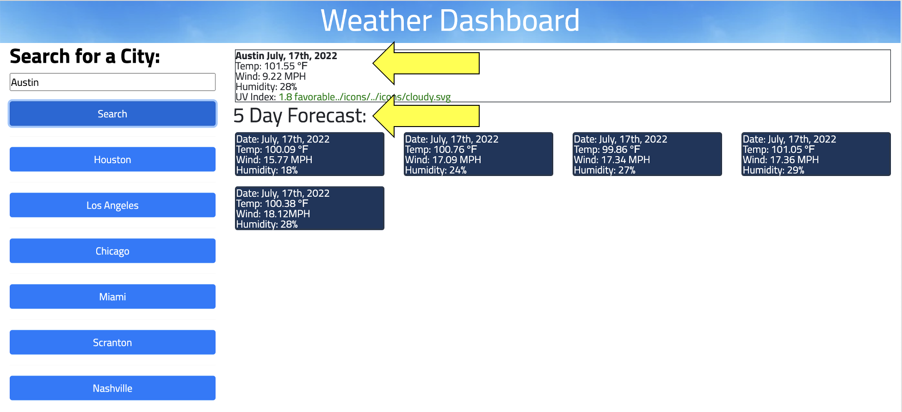

# Weather-Dashboard

## Project Description:
The task for this challenge was to create a weather dashboard.

#### You can access this project via [GitHub]( https://brianlalli.github.io/Weather-Dashboard/)

 

## Mock Up

## How It Works
First, you are brought to a landing page with a search bar allowing you to search for a city.

 

Type in a city and click Search!

 

Next, you can see the current weather as well as a 5-day forecast!

 

## Credits:
[Sara Baqla](https://github.com/missatrox44)

 

## Sources:
[jQuery](https://api.jquery.com/addclass/)

[Moment](https://momentjs.com/docs/#/displaying/)

[OpenWeatherApiKeys](https://home.openweathermap.org/api_keys)

[OpenWeatherConditions](https://openweathermap.org/weather-conditions)

[Bootstrap Icons](https://icons.getbootstrap.com/)

[Stack Overflow](https://stackoverflow.com/questions/65274643/changing-background-color-with-else-if-statement-jquery)

[CSS Styling by Bootsrap](https://startbootstrap.com/)

 

## MIT License:

Copyright (c) 2022 Brian Lalli
